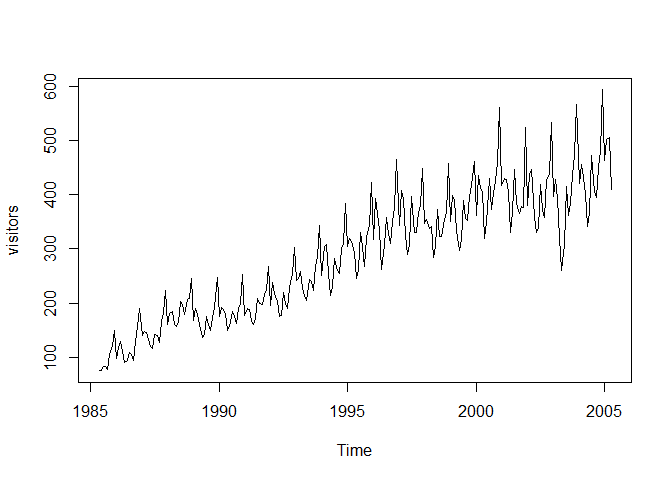
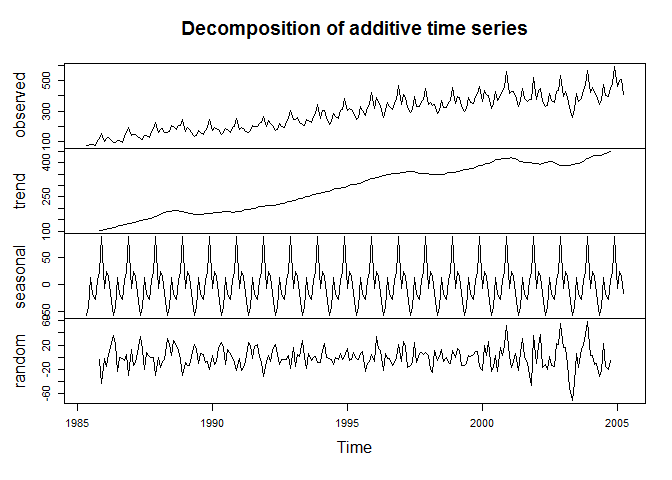
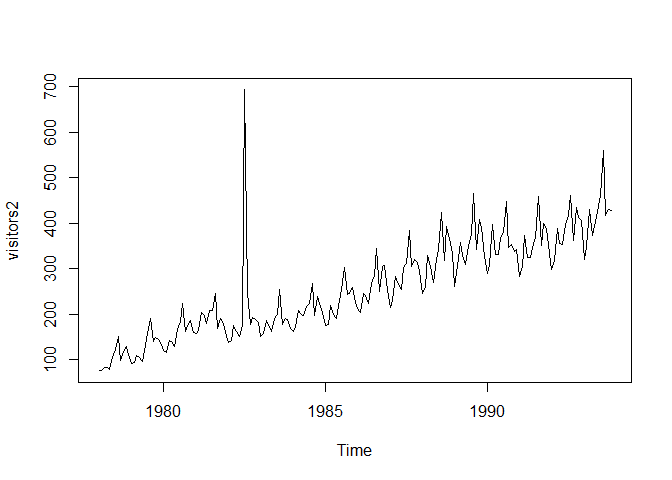
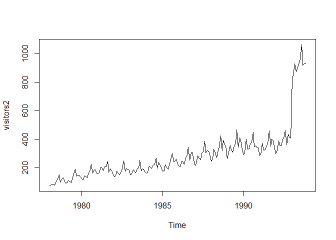
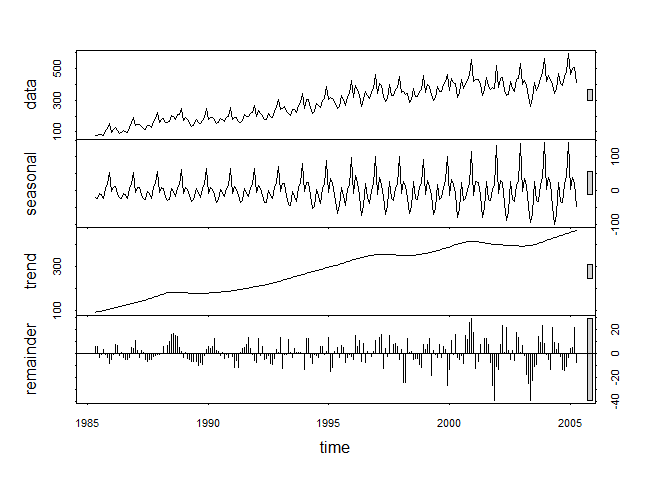
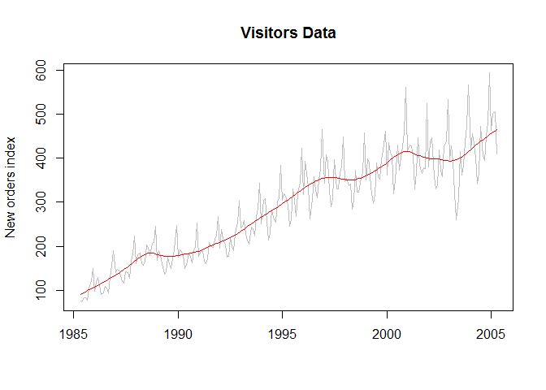

# LiveSessionAssignment-11
Rajni Goyal  
November 14, 2016  


##Problem Statement
#####a)	Plot the time series. Can you identify seasonal fluctuations and/or a trend? 
#####b)	Use a classical decomposition to calculate the trend-cycle and seasonal indices. 
#####c)	Do the results support the graphical interpretation from part (a)? 
#####d)	Compute and plot the seasonally adjusted data. 
#####e)	Change one observation to be an outlier (e.g., add 500 to one observation), and recompute the seasonally adjusted data. What is the effect of the outlier? 
#####f)	Does it make any difference if the outlier is near the end rather than in the middle of the time series? 
#####g)	Use STL to decompose the series. 

##Introduction

#####In this assignment, we use the monthly Australian short-term overseas visitors data to identify seasonal fluctutations or to see if any paricular trend exsts in the data. Then we'll use classical decomposition to calculate the trend-cycle and seasonal indices and seasonally adjusted data to identify outliers.


```r
#Plot the time series. Can you identify seasonal fluctuations and/or a trend? 
#install.packages("fpp")
data(visitors)
class(visitors)
```

```
## [1] "ts"
```

```r
summary(visitors)
```

```
##    Min. 1st Qu.  Median    Mean 3rd Qu.    Max. 
##    75.4   189.2   303.1   288.2   378.7   593.1
```

```r
plot(visitors)
```

<!-- -->

#####This time series has an upward linear trend and yearly seasonal variations.When the time series increase the seasonal variation increase more and more.It probably has some cyclical variations too, but this third component seems to be less significant than the other two. This plot indicates multiplicity in data set.


```r
#	Use a classical decomposition to calculate the trend-cycle and seasonal indices.
fitd <- decompose(visitors)
plot(fitd)
```

<!-- -->


```r
#Do the results support the graphical interpretation from part (a)? 
```

#####Yes, the results support the graphical interpretation from part(a). As can be seen, the trend is linear upward and  seasonal variations also increase more and more as time series increases.


```r
#Compute and plot the seasonally adjusted data. 
eeadj <- seasadj(fitd)
plot(eeadj)
```

<!-- -->


```r
#Change one observation to be an outlier (e.g., add 500 to one observation), and recompute the seasonally adjusted data. What is the effect of the outlier? 
visitors2 <-ts(c(visitors[1:54],visitors[55]+500,visitors[56:191]),start=c(1978,1),frequency=12)
plot(visitors2)
```

<!-- -->


#####It looks like the outlier is an additive outlier.The additive outlier is a point outlier which occurred at a given date or time of the year. It affects one observation only and is modeled by the variable.


```r
visitors2 <-ts(c(visitors[1:54],visitors[55:180],visitors[181:191]+500),start=c(1978,1),frequency=12)
plot(visitors2) 
```

<!-- -->

#####It looks like that an outlier at the end affects all the observations and the effect is consistent after that .


```r
#Does it make any difference if the outlier is near the end rather than in the middle of the time series? 
```

#####Yes, it makes a difference. If the outlier is in middle, then it looks like one time due to certain event. But the outlier in the end is more consistent and it looks like the same trend continues after the certain event. 


```r
#Use STL to decompose the series. 
fit <- stl(visitors, s.window=5)
plot(fit)
```

<!-- -->

```r
plot(visitors, col="gray",main="Visitors Data",ylab="New orders index", xlab="")
lines(fit$time.series[,2],col="red",ylab="Trend")
```

<!-- -->

##Conclusion

#####Often, the decomposition is used to removes the seasonal effect from a time series. It provides a cleaner way to understand the trend. For instance, lower visitors during winter don’t mean the tourism industry is performing poorly. To know the answer, we need to remove the seasonality from the time series. We use the seasonally adjusted time series to detect anomalies. We also use the random sub-time series from the decomposed time series to detect anomalies and outliers.
